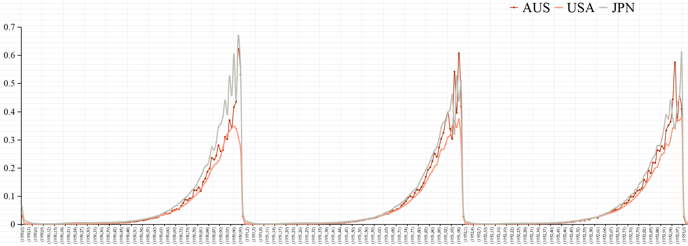
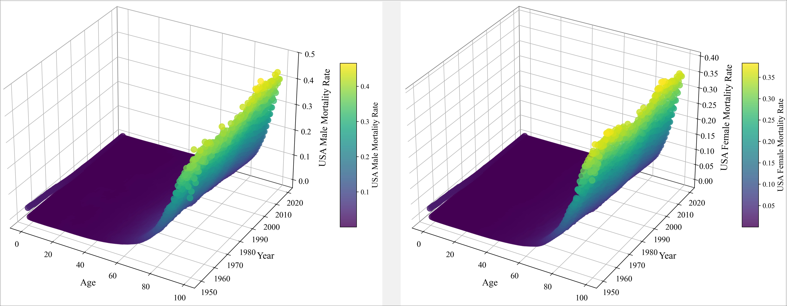
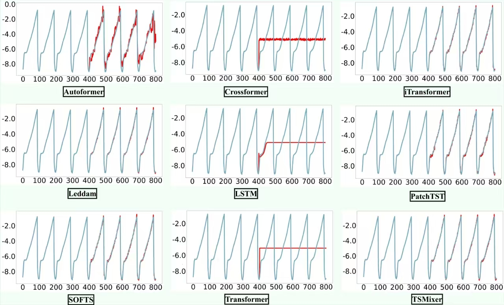

## Introduction

🌟 Considering the characteristics of real-world mortality data across different countries, which exhibit the traits of multivariate time series, this repository is dedicated to deploying and evaluating various state-of-the-art multivariate time series forecasting models on female and male mortality data from 24 countries.

<p align="center">

</p>
<p align="center">

</p>

## Usage

1. Prepare the enviorment. For convenience, execute the following command.

```
pip install -r requirements.txt
```
2. Prepare Data. Since the original mortality values are too small, we **FOLLOW** other work and choose to use the **log function** values of the original values as the actual input and evaluation values. You can get the converted data using the following command.
```
pythoon log_transform.py
```
3. Train and evaluate model. We provide the experiment scripts for all benchmarks under the folder `./TSF/`. You can reproduce the experiment results as the following examples:

```
# Multivairate forecasting on Feamle data
bash TSF/Female/MM/pred/Autoformer.sh

# Univairate forecasting on Feamle data (Take USA as a example)
bash TSF/Female/SS/pred/Autoformer.sh
```
## Forecasting Visualization
<p align="center">

</p>

## **Compared models of this project:** 
  - [x] **TSMixer** - TSMixer: An All-MLP Architecture for Time Series Forecasting [[arXiv 2023]](https://arxiv.org/pdf/2303.06053.pdf) [[Code]](https://github.com/IUTV815/GTF4MF/blob/main/model/TSMixer.py)
  - [x] **iTransformer** - iTransformer: Inverted Transformers Are Effective for Time Series Forecasting [[ICLR 2024]](https://arxiv.org/abs/2310.06625) [[Code]](https://github.com/IUTV815/GTF4MF/blob/main/model/iTransformer.py).
  - [x] **PatchTST** - A Time Series is Worth 64 Words: Long-term Forecasting with Transformers [[ICLR 2023]](https://openreview.net/pdf?id=Jbdc0vTOcol) [[Code]](https://github.com/IUTV815/GTF4MF/blob/main/model/PatchTST.py).
  - [x] **Autoformer** - Autoformer: Decomposition Transformers with Auto-Correlation for Long-Term Series Forecasting [[NeurIPS 2021]](https://openreview.net/pdf?id=I55UqU-M11y) [[Code]](https://github.com/IUTV815/GTF4MF/blob/main/model/Autoformer.py).
  - [x] **Transformer** - Attention is All You Need [[NeurIPS 2017]](https://arxiv.org/abs/1706.03762)[[Code]](https://github.com/IUTV815/GTF4MF/blob/main/model/Transformer.py).
  - [x] **Crossformer** - Crossformer: Transformer Utilizing Cross-Dimension Dependency for Multivariate Time Series Forecasting [[ICLR 2023]](https://openreview.net/pdf?id=vSVLM2j9eie)[[Code]](https://github.com/IUTV815/GTF4MF/blob/main/model/Crossformer.py).
  - [x] **Leddam** - Revitalizing Multivariate Time Series Forecasting: Learnable Decomposition with Inter-Series Dependencies and Intra-Series Variations Modeling [[ICML 2024]](https://arxiv.org/abs/2402.12694)[[Code]](https://github.com/IUTV815/GTF4MF/blob/main/model/Leddam.py).
  - [x] **SOFTS** -SOFTS: Efficient Multivariate Time Series Forecasting with Series-Core Fusion [[NeurIPS 2024]](https://arxiv.org/abs/2404.14197)[[code]](https://github.com/IUTV815/GTF4MF/blob/main/model/SOFTS.py)
  - [x] **LSTM** -Long Short-Term Memory. [[Neural Computation]](https://dl.acm.org/doi/10.1162/neco.1997.9.8.1735)[[code]](https://github.com/IUTV815/GTF4MF/blob/main/model/LSTM.py)
